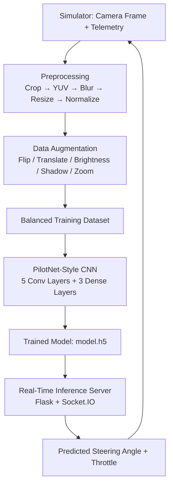

# DriveNet — CNN-Based Autonomous Steering Model

A behavioral-cloning self-driving simulation that predicts real-time steering angles from front-facing camera images, inspired by NVIDIA's end-to-end self-driving architecture ("PilotNet").

---

## What We Did

We built a full pipeline that takes raw simulator driving data (camera frames + steering/throttle/speed logs) and trains a convolutional neural network to autonomously predict steering angles in real time. The finished model is deployed as a live inference server that connects back to the driving simulator and controls the car.

The project covers the full ML lifecycle:
1. **Data collection** — driving logs and camera frames captured from the simulator
2. **Data balancing** — correcting a heavily skewed steering angle distribution
3. **Preprocessing** — cleaning and standardizing images for the model
4. **Augmentation** — synthetically expanding the dataset to improve generalization
5. **Model architecture** — a CNN based on NVIDIA's PilotNet design
6. **Training** — supervised training on steering angle regression
7. **Deployment** — real-time inference server streaming predictions back to the simulator

---

## How We Did It

### 1. Data Balancing (`dataBalancing.py`)
Raw driving logs are heavily biased toward a steering angle of 0 (driving straight). We used histogram-based binning (25 bins) and capped each bin at a maximum of 1,000 samples, randomly discarding excess samples. This prevents the model from learning a "just drive straight" bias.

### 2. Preprocessing (`data_preprocessing.py`)
Each image is:
- Cropped to remove the sky and car hood (keeping only the relevant road region)
- Converted from RGB to YUV color space (matching NVIDIA's original architecture)
- Smoothed with a Gaussian blur to reduce noise
- Resized to 200×66 to match the model's input shape
- Normalized to a 0–1 pixel range

### 3. Data Augmentation (`data_augmentation.py`)
To improve generalization and reduce overfitting, each training image can be randomly:
- Flipped horizontally (inverting the steering label accordingly)
- Translated horizontally/vertically (adjusting steering proportionally)
- Brightness-adjusted
- Shadowed (simulating lighting conditions/obstructions)
- Zoomed

### 4. Model Architecture (`model.py`)
A CNN modeled after NVIDIA's PilotNet:

| Layer | Type | Details |
|---|---|---|
| 1 | Conv2D | 24 filters, 5×5, stride 2, ELU |
| 2 | Conv2D | 36 filters, 5×5, stride 2, ELU |
| 3 | Conv2D | 48 filters, 5×5, stride 2, ELU |
| 4 | Conv2D | 64 filters, 3×3, ELU |
| 5 | Conv2D | 64 filters, 3×3, ELU |
| 6 | Flatten | — |
| 7 | Dense | 100, ELU |
| 8 | Dropout | 0.5 |
| 9 | Dense | 50, ELU |
| 10 | Dense | 10, ELU |
| 11 | Dense | 1 (steering angle output) |

Trained with Mean Squared Error loss and the Adam optimizer (learning rate 0.0001), since steering angle prediction is a regression problem.

### 5. Real-Time Deployment (`TestSimulation.py`)
A Socket.IO + Flask server connects to the simulator over websockets. For every telemetry event:
1. Receive the current camera frame + speed from the simulator
2. Preprocess the frame identically to training
3. Run inference to predict a steering angle
4. Calculate throttle based on a target max speed
5. Send the steering + throttle command back to the simulator in real time

---

## Architecture Diagram



*(Training happens offline using logged data; the trained model is then loaded into the real-time server, which forms a live feedback loop with the simulator.)*

---

## Tech Stack

`Python` · `TensorFlow / Keras` · `OpenCV` · `NumPy` · `Pandas` · `Flask` · `Socket.IO`

---

## Repo Structure

```
├── IMG/                        # Captured driving frames
├── driving_log.csv             # Raw driving log (center/left/right images, steering, etc.)
├── driving_log_balanced.csv    # Balanced dataset after sampling correction
├── dataBalancing.py            # Histogram-based dataset balancing
├── dataPlotting.py             # Visualizes steering angle distribution
├── data_preprocessing.py       # Image preprocessing pipeline
├── data_augmentation.py        # Image augmentation functions
├── model.py                    # PilotNet-style CNN architecture
├── train.py                    # Model training script
├── TestSimulation.py           # Real-time inference server (Flask + Socket.IO)
└── model.h5                    # Trained model weights
```
