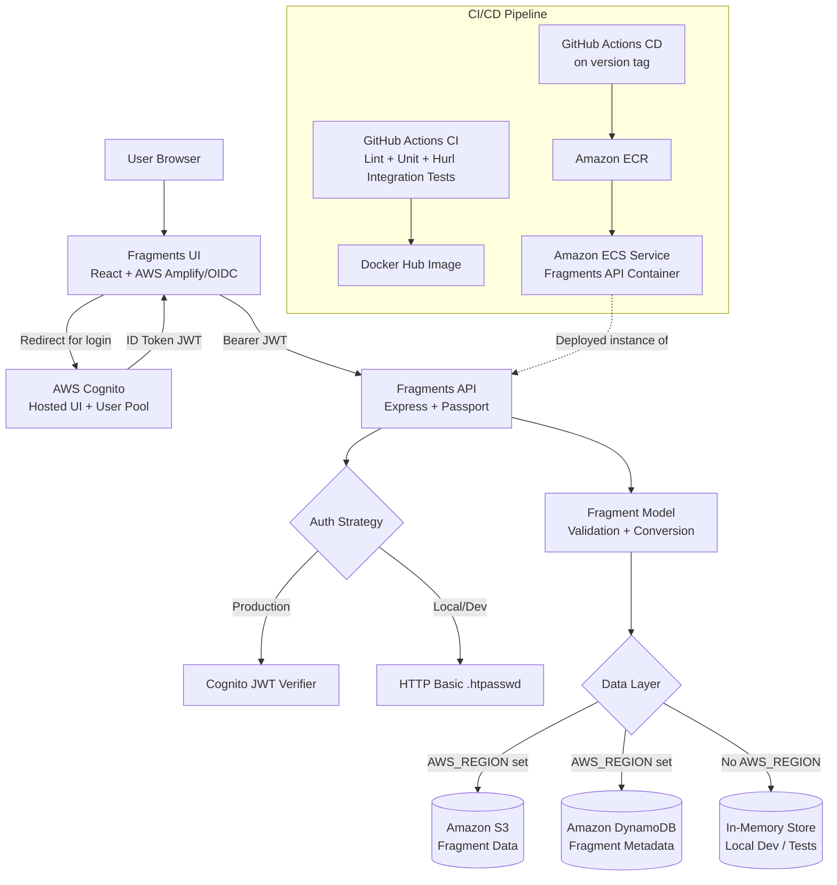

# Fragments - Cloud-Native Microservice for Storing & Converting Data Fragments

A full-stack, cloud-native web service that lets authenticated users create small pieces of data ("fragments") in one format and convert them to another on demand — text, Markdown, HTML, CSV, JSON/YAML, and images — backed by AWS-managed infrastructure and deployed via a fully automated CI/CD pipeline.

---

## What We Did

We built a two-part system: a RESTful backend API (`fragments`) that stores, retrieves, converts, and deletes user-owned data fragments, and a React frontend (`fragments-ui`) that authenticates users and lets them manage their fragments through a browser.

The project covers the full lifecycle of a production cloud service:

1. **API design** - a versioned REST API (`/v1/fragments`) for CRUD operations on fragments
2. **Authentication** - pluggable auth (AWS Cognito in production, HTTP Basic Auth for local/dev) via Passport strategies
3. **Storage abstraction** - a swappable data layer, backed by an in-memory store locally and Amazon S3 + DynamoDB in production
4. **Format conversion** - on-the-fly conversion between supported MIME types (e.g. Markdown → HTML, JSON → YAML, PNG → WebP)
5. **Frontend client** - a React app using AWS Amplify/OIDC to authenticate and call the API
6. **Containerization** - multi-stage Docker builds for both services
7. **CI/CD** - automated linting, unit + integration testing, image publishing, and deployment to AWS ECS

---

## How We Did It

### 1. API Layer (`src/routes/api/`)
An Express router exposes versioned endpoints under `/v1/fragments`:
- `POST /fragments` - create a new fragment from a raw request body, validated against a supported MIME type whitelist
- `GET /fragments` - list the authenticated user's fragments (optionally expanded to full metadata)
- `GET /fragments/:id` - fetch a fragment's raw data
- `GET /fragments/:id.:ext` - fetch a fragment converted to a target extension (e.g. `.html`, `.yaml`, `.webp`)
- `GET /fragments/:id/info` - fetch a fragment's metadata only
- `PUT /fragments/:id` - update a fragment's content (type must match)
- `DELETE /fragments/:id` - delete a fragment's data and metadata

### 2. Authentication (`src/auth/`)
Auth is implemented as interchangeable Passport strategies, selected automatically based on environment variables:
- **AWS Cognito** (`cognito.js`) - verifies Bearer JWTs against a Cognito User Pool using `aws-jwt-verify`, with JWKS cached at startup. Used in production.
- **HTTP Basic Auth** (`basic-auth.js`) - validates credentials against an `.htpasswd` file. Used for local development and CI, never in production.
- A shared `auth-middleware.js` wraps whichever strategy is active, hashes the authenticated user's identity (email), and attaches it to `req.user` so fragments are scoped per-owner.

### 3. Fragment Model & Conversion (`src/model/fragment.js`)
The `Fragment` class encapsulates validation, metadata, and format conversion:
- Validates supported MIME types (`text/plain`, `text/markdown`, `text/html`, `text/csv`, `application/json`, `application/yaml`, and `image/png|jpeg|webp|avif|gif`)
- `convertTo(ext)` handles conversions per type family: Markdown → HTML via `markdown-it`, JSON → YAML via `js-yaml`, and image format conversions via `sharp`
- Exposes each fragment's valid target `formats` so the API can reject unsupported conversions with a `415`

### 4. Storage Abstraction (`src/model/data/`)
A single `data/index.js` entry point picks the backing store at runtime:
- **In-memory** (`memory/`) - two in-process key/value stores simulating S3 (blob data) and DynamoDB (metadata), used for local dev and fast unit tests
- **AWS** (`aws/`) - a real S3 client for fragment data (`Bucket/ownerId/id`) and a DynamoDB client for metadata, queried by `ownerId` partition key
- Selection is automatic: if `AWS_REGION` is set, the service uses AWS; otherwise it falls back to memory, with a warning logged

### 5. Frontend Client (`fragments-ui/src/`)
A React 19 single-page app built with Parcel:
- `auth.js` - uses `oidc-client-ts` to redirect users to the Cognito Hosted UI, handle the OAuth callback, and expose an `authorizationHeaders()` helper for API calls
- `api.js` - a thin fetch-based client wrapping all backend endpoints (list, get, create, update, delete, convert)
- `App.js` - drives the UI: login, fragment creation (text or image upload), a live list of the user's fragments, format-aware "Convert to..." menus, and view/update/delete actions

### 6. Containerization & Deployment
- **Backend**: multi-stage `Dockerfile` (Node 22 build stage → Alpine production stage), exposing port 8080
- **Frontend**: multi-stage `Dockerfile` (Node build stage running `parcel build` → Nginx serving the static output on port 80)
- **CI** (`ci.yml`): ESLint, Hadolint (Dockerfile linting), Jest unit tests, and Hurl-based integration tests against Dockerized dependencies (DynamoDB Local + MinIO), gating a Docker Hub image push
- **CD** (`cd.yml`): on version tag push, builds and pushes the image to Amazon ECR and rolls out a new Amazon ECS task definition/service, wired to Cognito, S3, and DynamoDB via injected environment variables

---

## Architecture Diagram



*(The UI authenticates users directly against Cognito, then calls the API with a Bearer token on every request. The API verifies that token, resolves the storage backend based on environment, and performs the requested fragment operation. Both services are independently containerized and shipped through their own CI/CD pipelines.)*

---

## Tech Stack

**Backend:** `Node.js` · `Express` · `Passport` · `AWS Cognito` · `Amazon S3` · `Amazon DynamoDB` · `Sharp` · `markdown-it` · `js-yaml` · `Jest` · `Hurl`

**Frontend:** `React` · `AWS Amplify` · `oidc-client-ts` · `Parcel`

**Infra & DevOps:** `Docker` · `GitHub Actions` · `Amazon ECR` · `Amazon ECS` · `Nginx`

---

## Repo Structure

```
fragments/                          # Backend API
├── src/
│   ├── app.js                      # Express app: middleware, routing, 404 handler
│   ├── server.js / index.js        # Server bootstrap
│   ├── auth/                       # Cognito + HTTP Basic auth strategies
│   ├── model/
│   │   ├── fragment.js             # Fragment class: validation + format conversion
│   │   └── data/
│   │       ├── aws/                # S3 + DynamoDB clients (production)
│   │       └── memory/             # In-memory store (local/dev/test)
│   ├── routes/api/                 # GET/POST/PUT/DELETE route handlers
│   ├── response.js                 # Standard success/error response shapes
│   └── logger.js                   # Pino structured logging
├── tests/                          # Unit (Jest) + integration (Hurl) tests
├── Dockerfile                      # Multi-stage build (Node → Alpine)
├── docker-compose.yml              # Local stack: API + DynamoDB Local + LocalStack
├── fragments-definition.json       # ECS task definition
└── .github/workflows/              # ci.yml, cd.yml

fragments-ui/                       # Frontend client
├── src/
│   ├── index.html / index.js       # App entry point
│   ├── App.js                      # Main UI: login, fragment CRUD, conversion menu
│   ├── auth.js                     # Cognito OIDC login/callback handling
│   └── api.js                      # Fetch client for the Fragments API
├── Dockerfile                      # Multi-stage build (Node/Parcel → Nginx)
└── package.json
```