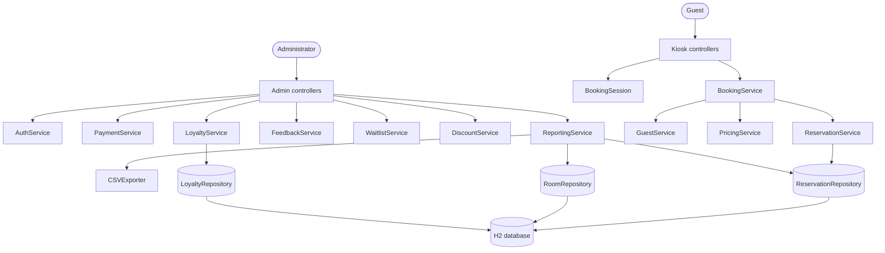
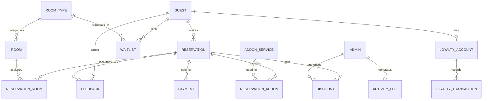

# RXH Grand Hotel Reservation System

A hotel reservation and administration application written in Java. It was built to practise **layered (3-tier) architecture**: controllers, a service layer and a repository layer, with an H2 database underneath.

Guests book rooms through a **kiosk flow**. Administrators manage reservations, payments, loyalty, feedback, discounts, the waitlist and reports through an **admin interface**.

## Features

**Guest kiosk**
- Enter stay dates and guest details
- Select rooms and add-ons
- Confirm the reservation

**Admin**
- Secure admin login
- Manage reservations and check-out
- Record payments (cash, card, loyalty points)
- Manage loyalty accounts and points
- Review guest feedback
- Manage the waitlist
- Apply discounts and promotions
- Operational reports and activity logs, with CSV export

## Architecture



### The three tiers

| Tier | Package | Responsibility |
|---|---|---|
| **Presentation** | `controller/kiosk`, `controller/admin`, `session` | Collect input, call a service, show the result. The `BookingSession` holds the booking while the guest moves through the kiosk screens. |
| **Business (service)** | `service`, `security` | Business rules: pricing, booking, the reservation lifecycle, payments, loyalty, waitlist, discounts, reporting and admin authentication. |
| **Data (repository)** | `repository`, `model` | Entities (`Guest`, `Reservation`, `Room`, `Discount`, `LoyaltyAccount`) and repositories that store and read them from H2. |

Calls only go downward, from presentation to service to repository. Controllers never touch the database, and repositories hold no business rules.

### Example flow: a guest books a room

1. The guest moves through the kiosk screens, and the **BookingSession** stages their choices.
2. `KioskConfirmationController` submits the booking to **BookingService**.
3. **BookingService** coordinates three services:
   - **GuestService** saves the guest.
   - **PricingService** calculates the price.
   - **ReservationService** saves the reservation through **ReservationRepository**.
4. Later, an admin records payment through **PaymentService**, and the reservation is checked out through **ReservationService**.

### Application setup

`Main` starts the application and `AppConfig` wires the dependencies together, creating the services and the controllers that use them.

## Project structure

```
RXH_GrandHotel/src/main/java/ca/seneca/apd545/RXHgrandhotel/
├── app/          Main, AppConfig (startup and dependency wiring)
├── controller/
│   ├── kiosk/    guest booking screens
│   └── admin/    admin screens (dashboard, waitlist, reports, ...)
├── session/      BookingSession
├── security/     AuthService
├── service/      Booking, Guest, Pricing, Reservation, Payment,
│                 Loyalty, Feedback, Waitlist, Discount, Reporting
├── repository/   ReservationRepository, RoomRepository, LoyaltyRepository
├── model/        Guest, Reservation, Room, Discount, LoyaltyAccount
└── util/         CSVExporter
```

## Database

The data tier is an embedded **H2** database. The design started as a 15-entity ERD drawn in draw.io, then was implemented as the working schema below.

| Table | Purpose |
|---|---|
| `GUESTS` | Guest details |
| `LOYALTY_ACCOUNTS` | One loyalty account per guest, with points |
| `ROOMS` | Room number, type, base price, adult and child capacity |
| `RESERVATIONS` | Stay dates, guest counts, status, subtotal, tax, total, payment state |
| `RESERVATION_ROOMS` | Rooms attached to a reservation, with quantity |
| `PAYMENTS` | Payments per reservation (cash, card, loyalty points) |
| `DISCOUNTS` | Percentage discounts applied to a reservation |
| `FEEDBACK` | Ratings and comments, with a sentiment tag |
| `WAITLIST` | Guests waiting for a room type on given dates |

Reservation status values: `BOOKED`, `CHECKED_IN`, `CHECKED_OUT`, `CANCELLED`. Room types: `SINGLE`, `DOUBLE`, `SUITE`.

### Design ERD



The ERD diagram files (`hotel_erd.drawio`, `RXH_grandhotel_DB.xml`) are the full design. The implemented schema is a simplified version of it. For example, room type became an enum on `ROOMS`.

## What this project demonstrates

- **Separation of concerns** across presentation, business logic and data access
- **The repository pattern**, which hides storage details from the rest of the app
- **A service layer** that holds the rules and coordinates several repositories
- **Dependency wiring** in one place (`AppConfig`)
- **Relational design**: normalisation, junction tables and constraints

## Course context

Built as a school project at Seneca (package `ca.seneca.apd545`).