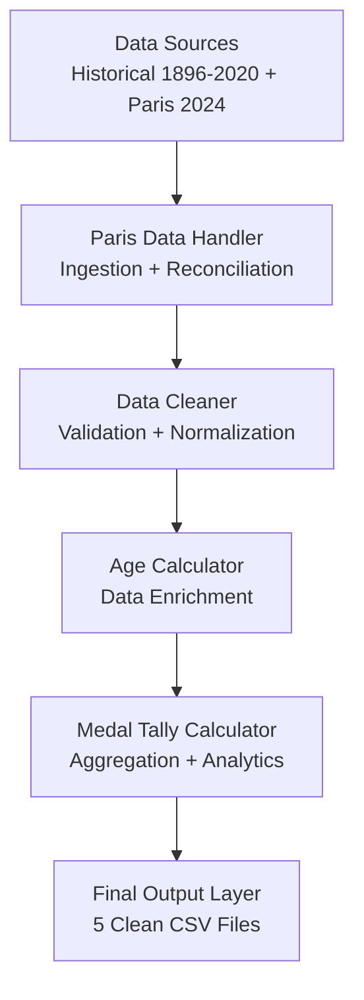

# Olympic Data Processing Pipeline

A data engineering pipeline that merges, cleans, and enriches over 130 years of Olympic athlete data (1896-2024) into a single, query-ready dataset - built entirely with core Python (no Pandas/NumPy).

---

## Project Info

| | |
|---|---|
| **Type** | Group project (4 members) |
| **My Role** | Team Lead - led development, architecture, and task delegation |
| **Focus Areas** | Large-scale data processing, algorithmic efficiency, data reconciliation, complexity optimization |
| **Language** | Python (dependency-free - no Pandas/NumPy) |

---

## Tools & Tech Used

`Python` `CSV` `Regex` `AST Parsing` `Hash Maps` `Sets` `Unit Testing` `Git`

---

## What We Did

We built a full ETL (Extract, Transform, Load) pipeline that takes two separate, messy Olympic datasets - historical results (1896-2020) and Paris 2024 data - and merges them into one clean, consistent, analysis-ready dataset, without creating duplicate athlete records.

The pipeline:
1. Ingests historical and Paris 2024 datasets
2. Reconciles athlete identities across both datasets (avoiding duplicates)
3. Cleans and standardizes messy/fuzzy data (dates, names, medals, positions)
4. Enriches data with derived fields (athlete age per Olympic edition)
5. Aggregates medal tallies by country and edition
6. Outputs five clean, final CSV files

---

## How We Did It

### 1. Data Ingestion & Reconciliation (`ParisDataHandler`)
Since Paris 2024 data uses a different ID system and name format than the historical dataset, we built a reconciliation layer that:
- Matches athletes across datasets using a normalized `(Name, NOC)` key
- Assigns new sequential IDs only to genuinely new athletes
- Prevents duplicate athlete and country records
- Detects team-based events using keyword matching against `teams.csv`

### 2. Data Cleaning (`DataCleaner`)
A fuzzy-parsing engine handles wildly inconsistent real-world data:
- Parses dates in many different formats (`"1990"`, `"24 November 1873"`, `"c. 1900"`, `"1990 or 1991"`) into a single standard `dd-Mon-yyyy` format
- Infers 2-digit years into full years using a pivot rule
- Validates medal values (`Gold`/`Silver`/`Bronze`/empty) and numeric positions
- Deduplicates country/NOC records
- Hardcodes known dates for Paris 2024 and Milano-Cortina 2026 where source data was missing

### 3. Data Enrichment (`AgeCalculator`)
- Builds cached lookup tables for athlete birthdates and Olympic edition dates
- Calculates each athlete's age at the time of competing, applying a special rule: if an athlete's birthday falls *during* the Games, it counts as already happened

### 4. Analytical Aggregation (`MedalTallyCalculator`)
- Aggregates gold/silver/bronze medal counts by country and edition
- Deduplicates medals for team events (e.g., a 12-player basketball team winning gold counts as **one** medal for the country, not twelve)
- Counts unique athletes per country per edition

### 5. Output
Produces five final, clean CSV files ready for querying or analysis.

---

## Design Focus: Performance & Complexity

Since the datasets involve 100k+ rows, raw nested-loop scanning (O(n²)) was too slow. We optimized using:

| Structure | Used For | Complexity |
|---|---|---|
| **Dictionaries (hash maps)** | Athlete `(name, NOC)` → ID lookup, column header mapping | O(1) lookup |
| **Sets** | Duplicate athlete detection (`existing_keys`) | O(1) membership check |
| **Lists** | Row storage (preserves CSV order) | O(1) append |
| **Regex / AST parsing** | Parsing event name lists with embedded commas (e.g., `"10,000m"`) | Avoids incorrect string splitting |

This brought the overall merge complexity down to approximately:

```
T(add_paris_data) = O(n + a + p + m)
```
where `n` = historical results, `a` = historical athletes, `p` = Paris athletes, `m` = Paris medallists - instead of the O(n·p) that a naive nested-loop approach would produce.

---

## Architecture Diagram



---

## Repo Structure

```
├── project.py              # Main pipeline entry point
├── paris_data_handler.py   # Merges & reconciles Paris 2024 data
├── data_cleaner.py         # Fuzzy date parsing & validation
├── age_calculator.py       # Athlete age enrichment
├── medal_tally.py          # Medal aggregation logic
├── runproject.py           # Timed execution runner
└── README.md
```

---

## Testing & Validation

- Automated format checks (dates, whitespace, NOC codes, no false-zero values)
- 7 defined test cases covering fuzzy date parsing, multi-country athletes, duplicate detection, and new athlete insertion
- Target: full pipeline execution in under 50 seconds across 130,000+ historical + 10,000 Paris records